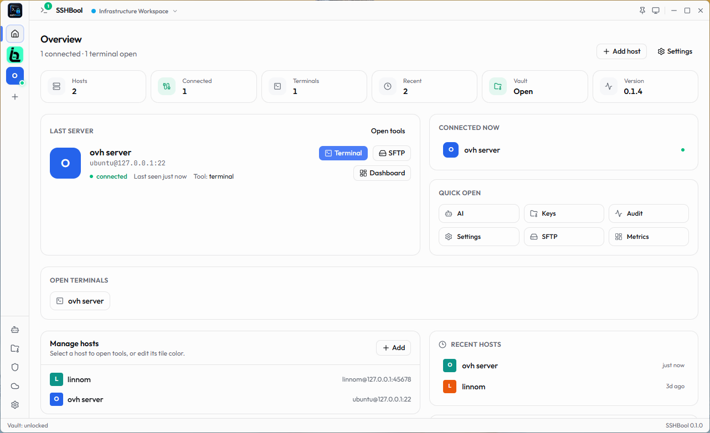
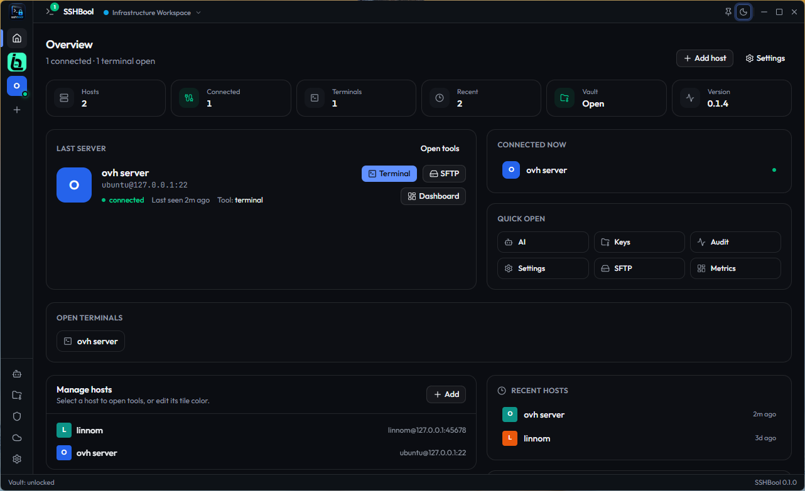
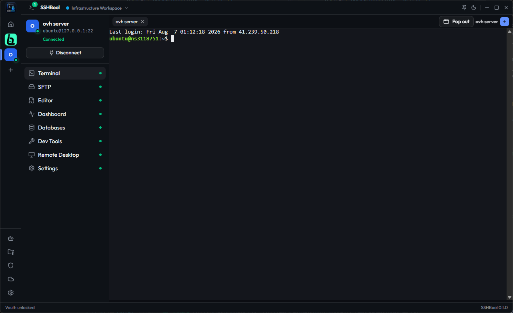
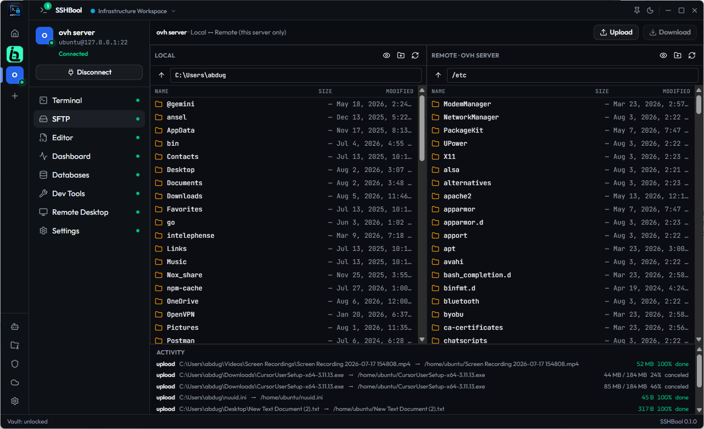

# SSHBool 🚀

<p align="center">
  <strong>A Native, Blazing-Fast Desktop Workspace for Remote Infrastructure Management</strong>
</p>

<p align="center">
  
  
  
  
  
</p>

---

## 📌 Overview

**SSHBool** is a native, premium, blazing-fast desktop workspace designed to unify remote infrastructure workflows. Instead of fragmenting your work across terminal emulators, standalone SFTP clients, database GUIs, and server monitoring dashboards, SSHBool gathers them all into a single, beautiful, keyboard-first workspace.

Built with a **"Connect once, do everything"** architecture, SSHBool opens a single multiplexed SSH connection to your server and routes all features (terminal sessions, file transfers, editor buffers, and database queries) through separate channels on that same connection, minimizing latency and server overhead.

---

## 🖼️ Screenshots

<div align="center">
  <table style="width:100%; border:none;">
    <tr>
      <td width="50%" align="center">
        <strong>Overview Dashboard & Host Management (Light Mode)</strong><br />
        
      </td>
      <td width="50%" align="center">
        <strong>Overview Dashboard & Host Management (Dark Mode)</strong><br />
        
      </td>
    </tr>
    <tr>
      <td width="50%" align="center">
        <strong>Active SSH Terminal Workspace (Tabbed Sessions)</strong><br />
        
      </td>
      <td width="50%" align="center">
        <strong>Dual-Pane SFTP File Manager (Local & Remote Explorer)</strong><br />
        
      </td>
    </tr>
  </table>
</div>

---

## ✨ Key Features

*   ⚡ **Native Performance:** Built on Rust and Tauri v2, bypassing the massive memory footprint of Electron. Starts in less than 800ms with a cold start connection time under 1.2s on LAN.
*   🔒 **Security by Default:**
    *   All host profiles, settings, and metadata are saved locally in an encrypted database using **SQLCipher (AES-256)**.
    *   Cryptographic keys derived via **Argon2id** from your master password.
    *   Hardware key support (FIDO2/YubiKey) for unlocking and authenticating connections.
*   🌐 **Multiplexed SSH Transport:** Opens a single connection per host. Terminals, file operations, monitoring metrics, and DB queries run asynchronously over the same TCP socket.
*   🖥️ **High-Performance Terminal:** An integrated, GPU-accelerated console powered by **Xterm.js** with WebGL rendering for ultra-fast text outputs.
*   📂 **Dual-Pane SFTP Client:** Side-by-side local and remote file explorers supporting drag-and-drop actions, download/upload queues, and transfer status monitoring.
*   📝 **Remote Text Editor:** Edit remote configuration files directly in the workspace using the integrated **Monaco Editor** with full syntax highlighting.
*   📊 **Live Server Monitoring:** Real-time metrics showing CPU, RAM, disk storage, and network utilization on the active remote host.
*   🗄️ **Database Inspector & Query Runner:** Automatically scans the remote host for active database ports (PostgreSQL, MySQL, Redis, MongoDB), connects to them, and lets you execute queries inside a terminal-friendly view.

---

## 🛠️ Tech Stack

*   **OS Desktop Wrapper:** Tauri v2 (Rust)
*   **Frontend Core:** React 19 + TypeScript + Vite
*   **State & Query Caching:** Zustand + TanStack Query v5
*   **Styling & UI:** TailwindCSS v4 + Base UI
*   **Local Database:** SQLCipher (SQLite with AES-256 at-rest encryption)
*   **SSH Transport:** russh (Async SSH client in Rust)
*   **Terminal & Editor:** Xterm.js & Monaco Editor

---

## 🚀 Getting Started

### Prerequisites
Make sure you have the following installed on your machine:
*   [Node.js](https://nodejs.org/) (LTS recommended)
*   [Rust toolchain](https://www.rust-lang.org/) (via rustup)
*   [Bun](https://bun.sh/) (as the default package runner)

### Installation & Development Run

1. **Install dependencies:**
   ```bash
   bun install
   ```

2. **Launch the app in development mode:**
   ```bash
   bun run tauri dev
   ```

3. **Run Quality checks:**
   ```bash
   # Typecheck typescript files
   bun run typecheck

   # Lint JS/TS codebase
   bun run lint

   # Run frontend unit tests
   bun run test

   # Run backend Rust tests
   cargo test --manifest-path src-tauri/Cargo.toml --workspace --lib
   ```

---

## 📂 Project Blueprint

For in-depth architectural documents, data schemas, and the development roadmap, refer to the [`docs/README.md`](docs/README.md) file.
